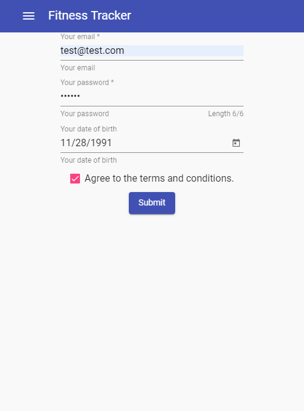
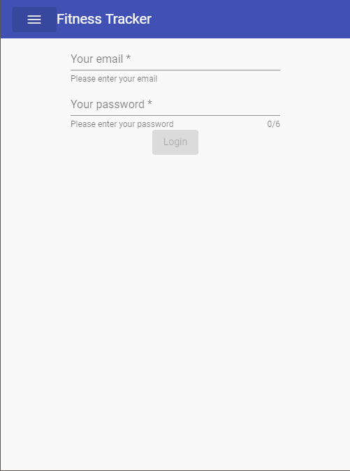
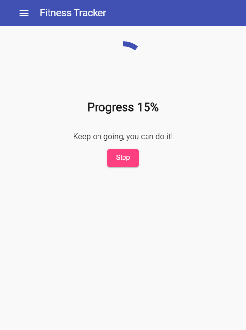
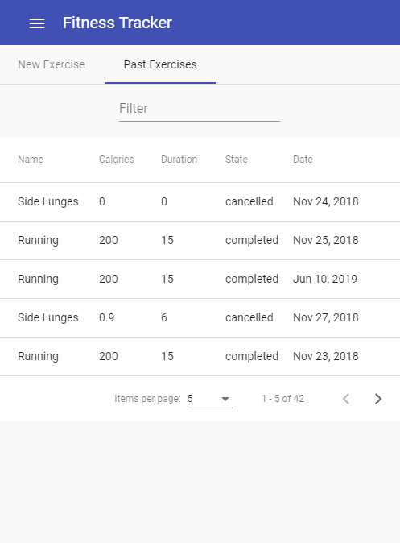

## Fitness Tracker application
* Developed using [Angular Material](https://material.angular.io/) as frontend
* [Google Firebase](https://firebase.google.com/) as backend

### Get started

Run `ng serve` for a dev server. Navigate to `http://localhost:4200/`. The app will automatically reload if you change any of the source files.

### Build for production

Run `ng build` to build the project. The build artifacts will be stored in the `dist/` directory. Use the `--prod` flag for a production build.

#### Screenshots:

  
  

 

  
  

 

  
  

